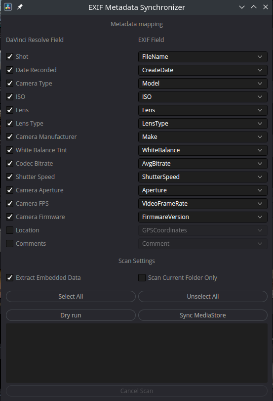

# DaVinci Resolve EXIF Metadata Synchronization Tool

Media clip attributes in DaVinci Resolve aren't synchronized with file's EXIF metadata. This tool provides simple synchronization between media files on disk and media pool item in DaVinci Resolve.

## Requirements

  - [exif tool](https://exiftool.org/), see [install page](https://exiftool.org/install.html)
    * Debian/Ubuntu: `sudo apt install libimage-exiftool-perl`
    * Fedora/RedHat: `sudo dnf install perl-Image-ExifTool.noarch`
    * macOS: `brew install exiftool` or install the [ExifTool MacOS Package](https://exiftool.org/install.html#MacOS)
    * Windows: [download exiftool installer](https://oliverbetz.de/pages/Artikel/ExifTool-for-Windows#toc-3)

## Compatibility

Tested on:

  * Resolve 16
  * Resolve 17
  * Resolve 18

## Installation

Copy the lua script file to following paths:

* Linux: `~/.local/share/DaVinciResolve/Fusion/Scripts/Comp`
* macOS `~/Library/Application Support/Blackmagic\ Design/DaVinci\ Resolve/Fusion/Scripts/Comp`
* Windows `%AppData%\Roaming\Blackmagic Design\DaVinci Resolve\Support\Fusion\Scripts\Comp`

### Linux

From command line:

Linux
```
wget https://raw.githubusercontent.com/deric/DaVinciResolve-metadata/main/com.deric.ExifMetadata/Scripts/Comp/EXIF-metadata.lua \
-P ~/.local/share/DaVinciResolve/Fusion/Scripts/Comp/
```

MacOS

```
wget https://raw.githubusercontent.com/deric/DaVinciResolve-metadata/main/com.deric.ExifMetadata/Scripts/Comp/EXIF-metadata.lua \ -P ~/Library/Application\ Support/Blackmagic\ Design/DaVinci\ Resolve/Fusion/Scripts/Comp
```

## Usage

 1. Import some media files from Media Storage to Project's Media Pool
 2. Select from main menu `Workspace > Scripts > EXIF-metadata`
 3. Select meta fields
 4. Run Sychronize Media Store



## How does it work

Each media pool item will be examined using the `exiftool` for checked meta fields. If present the value will be overwritten in clip's property. Such value then could be used for sorting or searching.

See Console output for actual command used to retrieve EXIF metadata.

In order to check available attributes you can use following command:

```bash
$ exiftool -ee -a /path/to/media.mov
...
Media Create Date               : 2018:07:12 18:04:40
Media Modify Date               : 2018:07:12 18:04:40
Media Time Scale                : 48000
Media Duration                  : 0:01:36
Handler Class                   : Media Handler
Handler Type                    : Audio Track
Handler Description             : SoundHandler
Balance                         : 0
Handler Class                   : Data Handler
Handler Type                    : URL
Handler Description             : DataHandler
Audio Format                    : sowt
Audio Channels                  : 2
Audio Bits Per Sample           : 16
Audio Sample Rate               : 48000
Layout Flags                    : Stereo
Audio Channels                  : 2
Software Version                : Lavf57.83.100
Image Size                      : 1920x1080
Megapixels                      : 2.1
Avg Bitrate                     : 46.7 Mbps
Rotation                        : 0
...
```


